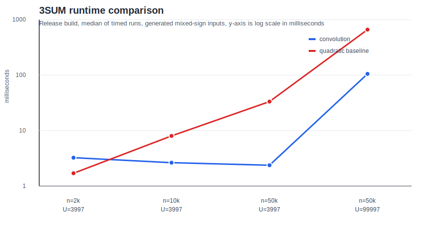

# 3SUM Solver

This repo contains a Rust implementation for checking 3SUM:

> Given input entries, determine whether there are distinct indices `i`, `j`, and `k` with $a_i + a_j + a_k = 0$.

The code answers that question directly rather than returning all matching triplets.

## What Is Implemented

`Solution::has_three_sum(nums)` solves bounded-integer 3SUM with exact convolution:

```rust
let result = Solution::has_three_sum(vec![-5, 2, 3, 7]);
assert_eq!(result, Some(true));
```

Return values:

- `Some(true)` means a zero-sum triple exists.
- `Some(false)` means no zero-sum triple exists.
- `None` means the integer universe is too large for this bounded-integer method.

The implementation builds a frequency vector over the input value range, squares it with Number Theoretic Transform convolution, then checks whether any pair sum $a_i + a_j$ can be paired with a third entry $a_k = -(a_i + a_j)$.

## Scope

This implementation is limited to bounded integers:

- Let $U = \max(nums) - \min(nums) + 1$.
- Runtime is approximately $O(U \log U)$.
- It is fast when $U$ is bounded relative to $n$.
- It intentionally returns `None` for very large universes instead of silently falling back to quadratic time.

## Compute

The benchmark compares the convolution implementation with a sorted two-pointer baseline on generated mixed-sign inputs. These are five-run local release-build averages, so treat them as directional rather than absolute.



Raw numbers are in `docs/compute.csv`.

## Usage

Run the tests:

```sh
cargo test
```

Run the benchmark:

```sh
cargo run --release --example benchmark
```

Use as a library:

```rust
use three_sum::Solution;

fn main() {
    let nums = vec![-1, 0, 1, 2];
    println!("{:?}", Solution::has_three_sum(nums));
}
```

## Files

- `three_sum.rs` - library implementation and tests
- `examples/benchmark.rs` - benchmark used for the compute plot
- `docs/compute.svg` - runtime comparison plot
